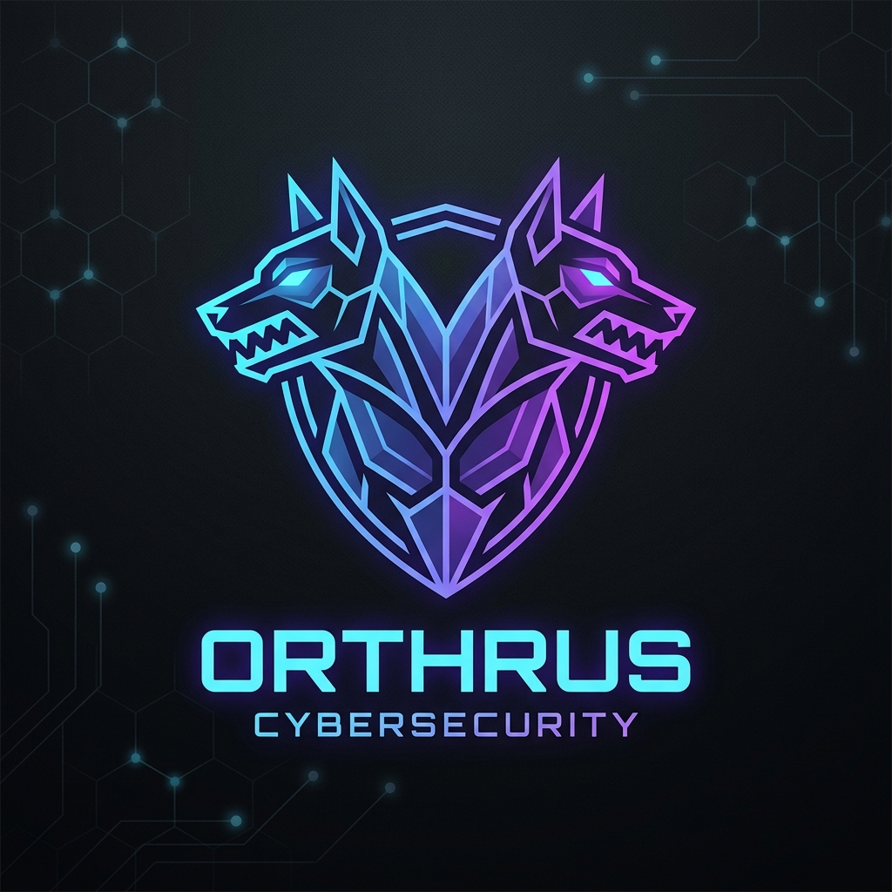

# Orthrus DAST

<p align="center">
  
</p>

Orthrus DAST is a modern, reactive Dynamic Application Security Testing (DAST) tool designed for APIs. Built with Spring Boot and WebFlux, it scans your API endpoints for common vulnerabilities like SQL Injection, Broken Authentication, BOLA, XSS, SSRF, CORS misconfigurations, and more.

## Features

### Discovery Modes
Orthrus supports 5 discovery modes to map your API surface:
- `openapi`: Parses OpenAPI v3 specifications (JSON/YAML)
- `graphql`: Utilizes the GraphQL introspection query to dump the schema, dynamically building valid queries and mutations for testing.
- `blackbox`: Crawls and fuzzes a target URL to discover endpoints dynamically.
- `gateway`: Connects to API Gateways (Traefik, Kong, Spring Cloud, HAProxy, K8s) to extract routing rules dynamically.
- `curl`: Reads cURL commands from a file.
- `well-known`: Scans for standard sensitive files (e.g. `/.env`, `/.git/config`).

#### Gateway Mode Details
The `gateway` mode probes the Gateway's Admin API to read its actual routing tables and automatically fuzzes the underlying routes.

**Supported Gateways:**
- Traefik (`/api/http/routers`)
- Spring Cloud Gateway (`/actuator/gateway/routes`)
- Kong API Gateway (`/routes`)
- HAProxy (`/v2/services/haproxy/configuration/acls`)
- Kubernetes Ingress (`/apis/networking.k8s.io/v1/ingresses`)

### 36 Specialized Scanners

| Scanner ID | Description | Associated CWE |
| --- | --- | --- |
| `auth-bruteforce` | Brute force / weak password detection on authentication endpoints (uses SecLists top-100) | CWE-307 (Improper Restriction of Excessive Authentication Attempts) |
| `bfla` | Broken Function Level Authorization via HTTP method replacement | CWE-285 (Improper Authorization) |
| `bola` | Broken Object Level Authorization (IDOR) via ID manipulation | CWE-639 (Authorization Bypass Through User-Controlled Key) |
| `broken-auth` | Missing Authentication for Critical Functions | CWE-306 (Missing Authentication for Critical Function) |
| `cleartext-transmission` | Detects unencrypted HTTP APIs | CWE-319 (Cleartext Transmission of Sensitive Information) |
| `cmd-injection` | OS Command Injection | CWE-78 (Improper Neutralization of Special Elements used in an OS Command) |
| `code-injection` | Injects eval/code payloads (PHP, Python, Node.js) to detect arbitrary code execution | CWE-94 (Improper Control of Generation of Code ('Code Injection')) |
| `content-type-spoofing` | XXE and parser errors via Content-Type manipulation | CWE-436 (Interpretation Conflict) / CWE-611 |
| `cookie-security` | Missing Secure, HttpOnly, and SameSite attributes in cookies | CWE-614 (Sensitive Cookie in HTTPS Session Without 'Secure' Attribute) |
| `cors` | Overly permissive CORS origins | CWE-942 (Permissive Cross-domain Policy with Untrusted Domains) |
| `cross-user-bola` | Advanced BOLA testing using a secondary user's token | CWE-639 (Authorization Bypass Through User-Controlled Key) |
| `csrf-protection` | Checks state-changing endpoints for missing Anti-CSRF tokens | CWE-352 (Cross-Site Request Forgery (CSRF)) |
| `file-upload` | Attempts to bypass validation by uploading EICAR signatures and malicious extensions | CWE-434 (Unrestricted Upload of File with Dangerous Type) |
| `graphql-dos` | Tests GraphQL endpoints for deeply nested queries triggering Resource Consumption DoS | CWE-770 (Allocation of Resources Without Limits or Throttling) |
| `graphql-injection` | Injects SQLi, XSS, and CmdInj payloads dynamically into GraphQL JSON variables | CWE-74 (Improper Neutralization of Special Elements in Output Used by a Downstream Component) |
| `graphql-introspection` | Detects if GraphQL introspection is enabled in production | CWE-200 (Exposure of Sensitive Information to an Unauthorized Actor) |
| `insecure-deserialization` | Sends magic byte payloads for Java, Python, and JSON gadgets | CWE-502 (Deserialization of Untrusted Data) |
| `jwt-blank-secret` | JWT blank secret bypass | CWE-310 (Cryptographic Issues) |
| `jwt-none-alg` | JWT 'none' algorithm bypass | CWE-347 (Improper Verification of Cryptographic Signature) |
| `mass-assignment` | Broken Object Property Level Auth (Mass Assignment) via JSON payloads | CWE-915 (Improperly Controlled Modification of Dynamically-Determined Object Attributes) |
| `method-tampering` | Exposure of unsafe HTTP methods like TRACE | CWE-650 (Trusting HTTP Permission Methods on the Server Side) |
| `nosql-injection` | MongoDB operator injection | CWE-943 (Improper Neutralization of Special Elements in Data Query Logic) |
| `open-redirect` | Unvalidated redirects | CWE-601 (URL Redirection to Untrusted Site ('Open Redirect')) |
| `path-traversal` | Directory Traversal for arbitrary file reads | CWE-22 (Improper Limitation of a Pathname to a Restricted Directory ('Path Traversal')) |
| `rate-limiting` | Lack of rate limiting on sensitive endpoints | CWE-770 (Allocation of Resources Without Limits or Throttling) |
| `request-smuggling` | Detects HTTP Request Smuggling vulnerabilities using malformed Transfer-Encoding headers | CWE-444 (Inconsistent Interpretation of HTTP Requests) |
| `schema-validation` | Enforces OpenAPI schema constraints (maxLength, required properties, data types) | CWE-20 (Improper Input Validation) |
| `security-headers` | Missing critical security headers (HSTS, CSP, etc.) | CWE-693 (Protection Mechanism Failure) |
| `sensitive-query-params` | Detects sensitive information (passwords, tokens) exposed in URL query strings | CWE-598 (Use of GET Request Method With Sensitive Query Strings) |
| `sqli` | SQL Injection in query parameters | CWE-89 (Improper Neutralization of Special Elements used in an SQL Command) |
| `ssl-tls` | Scans SSL/TLS certificates for expiration, weak protocols, self-signed issues, and weak signature algorithms | CWE-295 (Improper Certificate Validation) |
| `ssrf` | Server-Side Request Forgery via AWS metadata endpoints | CWE-918 (Server-Side Request Forgery (SSRF)) |
| `ssti` | Server-Side Template Injection via mathematical payloads | CWE-1336 (Improper Neutralization of Special Elements Used in a Template Engine) |
| `verbose-error` | Leaks of stack traces or sensitive errors | CWE-209 (Generation of Error Message Containing Sensitive Information) |
| `xss` | Reflected Cross-Site Scripting via query params, JSON bodies, and headers | CWE-79 (Improper Neutralization of Input During Web Page Generation ('Cross-site Scripting')) |
| `xxe-injection` | Injects malicious DTDs referencing external files like /etc/passwd | CWE-611 (Improper Restriction of XML External Entity Reference) |

## Getting Started

### Prerequisites
- Java 25 or higher
- Maven 3.8+
- Docker (optional, for containerized deployments)

### Building the Project
Compile and package the entire multi-module application:
```bash
./mvnw clean package -DskipTests
```
This generates three executable JARs:
- `orthrus-master/target/orthrus-master-0.0.1-SNAPSHOT.jar`
- `orthrus-slave/target/orthrus-slave-0.0.1-SNAPSHOT.jar`
- `orthrus-cli/target/orthrus-cli-0.0.1-SNAPSHOT.jar`

You can also build Docker images locally:
```bash
mvn spring-boot:build-image -pl orthrus-master
mvn spring-boot:build-image -pl orthrus-slave
mvn spring-boot:build-image -pl orthrus-cli
```

## Running the Application

### Using Docker Compose (Recommended)
You can quickly start a Master and Slave node using the provided `docker-compose.yml`:
```bash
docker-compose up -d
```

### Running Manually (Java)
1. **Start the Master node** (orchestrates scans and provides the Web UI):
   ```bash
   java -jar orthrus-master/target/orthrus-master-0.0.1-SNAPSHOT.jar
   ```
2. **Start one or more Slave nodes** (executes the actual high-concurrency scans):
   ```bash
   java -jar orthrus-slave/target/orthrus-slave-0.0.1-SNAPSHOT.jar --server.port=8081
   ```

### Security & Authentication
> **Note**: The Web UI and API are secured by default. You must log in using the default credentials:
> - **Username**: `superadmin`
> - **Password**: `superadmin`
> 
> You can change these by setting `ADMIN_USERNAME` and `ADMIN_PASSWORD` environment variables.

#### Single Sign-On (SSO) with OAuth2 / OIDC
Orthrus natively supports OAuth2/OIDC login via standard Spring Security configuration.
To enable SSO (e.g., with Keycloak, Auth0, Google), simply provide the standard `spring.security.oauth2.client` properties in your `application.yml` or as environment variables before starting the Master.

**Example: Generic OIDC SSO via Environment Variables**
```bash
export SPRING_SECURITY_OAUTH2_CLIENT_REGISTRATION_OIDC_CLIENT_ID="orthrus-client"
export SPRING_SECURITY_OAUTH2_CLIENT_REGISTRATION_OIDC_CLIENT_SECRET="your_client_secret"
export SPRING_SECURITY_OAUTH2_CLIENT_PROVIDER_OIDC_ISSUER_URI="https://your-idp.example.com/realms/master"
export SPRING_SECURITY_OAUTH2_RESOURCESERVER_JWT_ISSUER_URI="https://your-idp.example.com/realms/master"
java -jar orthrus-master/target/orthrus-master-0.0.1-SNAPSHOT.jar
```
When configured, the "Sign in with OpenID Connect" button will allow users to log in. Note that users logging in via OAuth2 will receive the default `ROLE_USER` role unless their token provides specific Orthrus roles mapping.

## Using the Web Interface
Once the Master is running, navigate to `http://localhost:8080` to access the Web UI.

- **Interactive Dashboard**: View statistics and a history of all executed scans.
- **Easy Configuration**: A "New Scan" form lets you select discovery modules, target URLs, and authentication methods.
- **Live Execution & Reporting**: See scan progress in real-time, view detailed findings with their respective risk grades (A to F), and export results directly as a **PDF**.
- **Integrated User Manual**: A detailed guide is accessible directly from the interface (`/manual`) explaining discovery modes and security grading.


## Using the Standalone CLI
If you want to run a scan from your terminal without spinning up the Master/UI infrastructure, use the CLI JAR autonomously.

```bash
java -jar orthrus-cli/target/orthrus-cli-0.0.1-SNAPSHOT.jar -d <DISCOVERER> -t <TARGET_URL> [OPTIONS]
```
### CLI Options
- `-d, --discoverer`: Discoverer to use (`openapi`, `blackbox`, `curl`, `well-known`).
- `-t, --target`: Target URL or Spec path.
- `-c, --concurrency`: Number of concurrent threads to use during the scan (default: 10). Increase for massive APIs to speed up execution.
- `--host`: Override the host URL for the target endpoints.
- `-f, --format`: Report format (`json`, `sarif`, `html`, `pdf`, `console`). Default is `console`.
- `--lang`: Report language when using PDF or HTML format (`en`, `fr`). Default is `en`.
- `-o, --out`: Output file path. If not provided, prints to standard output.
- `--auth-bearer`: Provide a Bearer token to inject into all requests (Primary User).
- `--auth-bearer-secondary`: Provide a secondary Bearer token for Cross-User BOLA testing (Secondary User).
- `--oauth2-url`: OAuth2 token endpoint URL (e.g., Keycloak token endpoint).
- `--oauth2-client-id`: OAuth2 Client ID.
- `--oauth2-client-secret`: OAuth2 Client Secret.
- `--oauth2-grant`: OAuth2 Grant Type (`password` or `client_credentials`).
- `--oauth2-creds`: Comma-separated list of `username:password` credentials (for `password` grant).
- `--include`: Comma-separated list of scanner IDs to run exclusively.
- `--exclude`: Comma-separated list of scanner IDs to skip.

**Generate a professional PDF report in French:**
```bash
java -jar orthrus-cli/target/orthrus-cli-0.0.1-SNAPSHOT.jar -d openapi -t https://api.example.com/v3/api-docs -f pdf --lang fr -o rapport_securite.pdf
```

**Automated OAuth2 Token Fetching for Cross-User BOLA (IDOR):**
```bash
java -jar orthrus-cli/target/orthrus-cli-0.0.1-SNAPSHOT.jar -d openapi -t https://api.example.com/v3/api-docs \
  --oauth2-url "https://keycloak.example.com/realms/master/protocol/openid-connect/token" \
  --oauth2-grant "password" \
  --oauth2-client-id "orthrus-client" \
  --oauth2-creds "alice:pwd123,bob:pwd456"
```

## Using the REST API
The Master node exposes a comprehensive REST API to trigger and manage scans programmatically.

**Trigger a basic scan:**
```bash
curl -u superadmin:superadmin -X POST http://localhost:8080/api/v1/scans \
  -H "Content-Type: application/json" \
  -d '{
    "discovererId": "well-known",
    "target": "https://example.com",
    "format": "json"
  }'
```

**Generate a PDF report in French with a Bearer token:**
```bash
curl -u superadmin:superadmin -X POST http://localhost:8080/api/v1/scans \
  -H "Content-Type: application/json" \
  -d '{
    "discovererId": "openapi",
    "target": "https://api.example.com/v3/api-docs",
    "format": "pdf",
    "language": "fr",
    "authScheme": {
      "type": "BEARER",
      "value": "TOKEN_USER_A",
      "headerName": "Authorization",
      "paramLocation": "HEADER"
    }
  }' --output report.pdf
```

**Test for Cross-User BOLA (IDOR) with two distinct users via API:**
```bash
curl -u superadmin:superadmin -X POST http://localhost:8080/api/v1/scans \
  -H "Content-Type: application/json" \
  -d '{
    "discovererId": "openapi",
    "target": "https://api.example.com/v3/api-docs",
    "format": "json",
    "authScheme": {
      "type": "BEARER",
      "value": "TOKEN_USER_A",
      "headerName": "Authorization",
      "paramLocation": "HEADER"
    },
    "secondaryAuthScheme": {
      "type": "BEARER",
      "value": "TOKEN_USER_B",
      "headerName": "Authorization",
      "paramLocation": "HEADER"
    }
  }'
```

## Adding Custom Scanners
Orthrus is designed to be highly extensible. To add a new scanner, implement the `SecurityScanner` interface and annotate the class with `@Component`.

```java
import ch.nexsol.vulnapi.scanner.SecurityScanner;
import org.springframework.stereotype.Component;

@Component
public class MyCustomScanner implements SecurityScanner {
    @Override
    public String getId() { return "my-custom-scanner"; }
    // Implement scan logic...
}
```

## Disclaimer

> [!WARNING]
> **Legal and Liability Disclaimer**
> 
> This tool (Orthrus) is designed exclusively for educational purposes and authorized security testing. Do **NOT** use it against systems, networks, or applications that you do not own or do not have explicit, documented permission to test.
>
> - **Theoretical Scoring**: The CVSS (Common Vulnerability Scoring System) Base Scores provided in the generated reports are purely theoretical and generalized for the type of vulnerability identified. They do not account for your specific environmental metrics, infrastructure mitigations, or temporal factors.
> - **No Warranty**: The tool relies on automated Dynamic Application Security Testing (DAST) techniques which are not infallible. It may produce false positives or, more importantly, **false negatives** (missing critical vulnerabilities).
> - **Limitation of Liability**: The authors, contributors, and the tool itself cannot be held liable for any undetected vulnerabilities, subsequent system compromises, data breaches, or any direct/indirect damages arising from the use of this software. 
> 
> **By using this tool, you accept full responsibility for your actions and any consequences that may result.**
