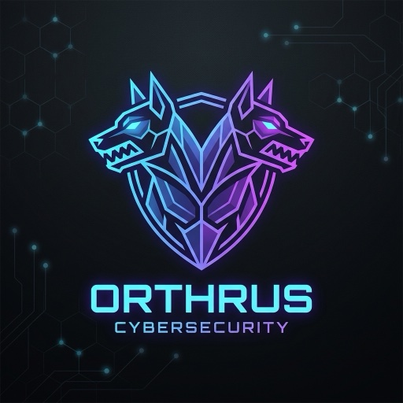

# Orthrus DAST

<p align="center">
  
</p>

Orthrus DAST is a modern, reactive Dynamic Application Security Testing (DAST) tool designed for APIs. Built with Spring Boot and WebFlux, it scans your API endpoints for common vulnerabilities like SQL Injection, Broken Authentication, BOLA, XSS, SSRF, CORS misconfigurations, and more.

## Features

### Discovery Modes
Orthrus supports 6 discovery modes to map your API surface:
- `openapi`: Parses OpenAPI v3 specifications (JSON/YAML)
- `graphql`: Utilizes the GraphQL introspection query to dump the schema, dynamically building valid queries and mutations for testing.
- `blackbox`: Crawls and fuzzes a target URL to discover endpoints dynamically.
- `gateway`: Connects to API Gateways (Traefik, Kong, Spring Cloud, HAProxy, K8s) to extract routing rules dynamically.
- `curl`: Registers a single target URL as the only operation to scan.
- `well-known`: Scans for standard sensitive files (e.g. `/.env`, `/.git/config`).

#### Gateway Mode Details
The `gateway` mode probes the Gateway's Admin API to read its actual routing tables and automatically fuzzes the underlying routes.

**Supported Gateways:**
- Traefik (`/api/http/routers`)
- Spring Cloud Gateway (`/actuator/gateway/routes`)
- Kong API Gateway (`/routes`)
- HAProxy (`/v2/services/haproxy/configuration/acls`)
- Kubernetes Ingress (`/apis/networking.k8s.io/v1/ingresses`)

### 41 Specialized Scanners

| Scanner ID | Description | Associated CWE |
| --- | --- | --- |
| `auth-bruteforce` | Brute force / weak password detection on authentication endpoints (uses SecLists top-100) | CWE-307 (Improper Restriction of Excessive Authentication Attempts) |
| `bfla` | Broken Function Level Authorization via HTTP method replacement | CWE-285 (Improper Authorization) |
| `bola` | Broken Object Level Authorization (IDOR) via ID manipulation | CWE-639 (Authorization Bypass Through User-Controlled Key) |
| `broken-auth` | Missing Authentication for Critical Functions | CWE-306 (Missing Authentication for Critical Function) |
| `cleartext-transmission` | Detects unencrypted HTTP APIs | CWE-319 (Cleartext Transmission of Sensitive Information) |
| `cmd-injection` | OS Command Injection | CWE-78 (Improper Neutralization of Special Elements used in an OS Command) |
| `code-injection` | Injects eval/code payloads (PHP, Python, Node.js) to detect arbitrary code execution | CWE-94 (Improper Control of Generation of Code ('Code Injection')) |
| `content-type-spoofing` | XXE and parser errors via Content-Type manipulation | CWE-436 (Interpretation Conflict) / CWE-611 |
| `cookie-security` | Missing Secure, HttpOnly, and SameSite attributes in cookies | CWE-614 (Sensitive Cookie in HTTPS Session Without 'Secure' Attribute) |
| `cors` | Overly permissive CORS origins | CWE-942 (Permissive Cross-domain Policy with Untrusted Domains) |
| `cross-user-bola` | Advanced BOLA testing using a secondary user's token | CWE-639 (Authorization Bypass Through User-Controlled Key) |
| `csrf-protection` | Checks state-changing endpoints for missing Anti-CSRF tokens | CWE-352 (Cross-Site Request Forgery (CSRF)) |
| `excessive-data-exposure` | Analyzes JSON/XML responses to detect exposed PII or sensitive fields lacking data masking | CWE-201 (Insertion of Sensitive Information Into Sent Data) |
| `file-upload` | Attempts to bypass validation by uploading EICAR signatures and malicious extensions | CWE-434 (Unrestricted Upload of File with Dangerous Type) |
| `graphql-dos` | Tests GraphQL endpoints for deeply nested queries triggering Resource Consumption DoS | CWE-770 (Allocation of Resources Without Limits or Throttling) |
| `graphql-injection` | Injects SQLi, XSS, and CmdInj payloads dynamically into GraphQL JSON variables | CWE-74 (Improper Neutralization of Special Elements in Output Used by a Downstream Component) |
| `graphql-introspection` | Detects if GraphQL introspection is enabled in production | CWE-200 (Exposure of Sensitive Information to an Unauthorized Actor) |
| `host-header-injection` | Manipulates the Host or X-Forwarded-Host header to provoke cache poisoning or blind SSRF | CWE-114 (Process Control) / CWE-644 |
| `hpp` | HTTP Parameter Pollution via duplicate parameters to test backend conflict handling | CWE-235 (Improper Handling of Extra Parameters) |
| `insecure-deserialization` | Sends magic byte payloads for Java, Python, and JSON gadgets | CWE-502 (Deserialization of Untrusted Data) |
| `jwt-blank-secret` | JWT blank secret bypass | CWE-310 (Cryptographic Issues) |
| `jwt-none-alg` | JWT 'none' algorithm bypass | CWE-347 (Improper Verification of Cryptographic Signature) |
| `mass-assignment` | Broken Object Property Level Auth (Mass Assignment) via JSON payloads | CWE-915 (Improperly Controlled Modification of Dynamically-Determined Object Attributes) |
| `method-tampering` | Exposure of unsafe HTTP methods like TRACE | CWE-650 (Trusting HTTP Permission Methods on the Server Side) |
| `nosql-injection` | MongoDB operator injection | CWE-943 (Improper Neutralization of Special Elements in Data Query Logic) |
| `open-redirect` | Unvalidated redirects | CWE-601 (URL Redirection to Untrusted Site ('Open Redirect')) |
| `pagination-dos` | Tests for excessive pagination size parameters causing database resource exhaustion | CWE-770 (Allocation of Resources Without Limits or Throttling) |
| `path-traversal` | Directory Traversal for arbitrary file reads | CWE-22 (Improper Limitation of a Pathname to a Restricted Directory ('Path Traversal')) |
| `rate-limiting` | Lack of rate limiting on sensitive endpoints | CWE-770 (Allocation of Resources Without Limits or Throttling) |
| `redos` | Regular Expression Denial of Service via malicious backtracking payloads | CWE-400 (Uncontrolled Resource Consumption) |
| `request-smuggling` | Detects HTTP Request Smuggling vulnerabilities using malformed Transfer-Encoding headers | CWE-444 (Inconsistent Interpretation of HTTP Requests) |
| `schema-validation` | Enforces OpenAPI schema constraints (maxLength, required properties, data types) | CWE-20 (Improper Input Validation) |
| `security-headers` | Missing critical security headers (HSTS, CSP, etc.) | CWE-693 (Protection Mechanism Failure) |
| `sensitive-query-params` | Detects sensitive information (passwords, tokens) exposed in URL query strings | CWE-598 (Use of GET Request Method With Sensitive Query Strings) |
| `sqli` | SQL Injection in query parameters | CWE-89 (Improper Neutralization of Special Elements used in an SQL Command) |
| `ssl-tls` | Scans SSL/TLS certificates for expiration, weak protocols, self-signed issues, and weak signature algorithms | CWE-295 (Improper Certificate Validation) |
| `ssrf` | Server-Side Request Forgery via AWS metadata endpoints | CWE-918 (Server-Side Request Forgery (SSRF)) |
| `ssti` | Server-Side Template Injection via mathematical payloads | CWE-1336 (Improper Neutralization of Special Elements Used in a Template Engine) |
| `verbose-error` | Leaks of stack traces or sensitive errors | CWE-209 (Generation of Error Message Containing Sensitive Information) |
| `xss` | Reflected Cross-Site Scripting via query params, JSON bodies, and headers | CWE-79 (Improper Neutralization of Input During Web Page Generation ('Cross-site Scripting')) |
| `xxe-injection` | Injects malicious DTDs referencing external files like /etc/passwd | CWE-611 (Improper Restriction of XML External Entity Reference) |

## Getting Started

### Prerequisites
- Docker and Docker Compose
- _(Only if you build the images from source)_ Java 25+ and Maven 3.8+

## Running the Application

Orthrus runs as a stack — PostgreSQL, the **Master** (Web UI + orchestration) and one or more **Workers** (high-concurrency scan execution) — brought up together with Docker Compose. This is the recommended and only supported way to run the platform.

### 1. Configure secrets
Every credential is mandatory: on the `prod` profile the Master refuses to start while the shipped defaults are still in place. Copy the template and fill it in:
```bash
cp .env.example .env
# edit .env and set at least:
#   POSTGRES_PASSWORD, ORTHRUS_INTERNAL_TOKEN, ADMIN_PASSWORD
```

### 2. Start the stack
```bash
docker compose up -d
```
This starts three services on a private network:
- `orthrus-postgres` — the database (schema applied automatically on first start)
- `orthrus-manager` — Web UI + REST API on **http://localhost:8080**
- `orthrus-worker` — a scan worker on `:8081`, auto-registered with the Master

Follow the logs and check status with:
```bash
docker compose logs -f orthrus-manager
docker compose ps
```

### 3. Stop the stack
```bash
docker compose down        # stop, keep the database volume
docker compose down -v     # stop and drop all persisted data
```

### Building the images from source (optional)
The `docker-compose.yml` references published images, so this step is only needed if you want to run your own build. It produces the Manager, Worker and CLI images locally:
```bash
mvn spring-boot:build-image -pl orthrus-manager
mvn spring-boot:build-image -pl orthrus-worker
mvn spring-boot:build-image -pl orthrus-cli
```


### Security & Authentication
> **Note**: The Web UI and API are secured. The admin account is configured through `.env`:
> - **Username**: `ADMIN_USERNAME` (defaults to `superadmin`)
> - **Password**: `ADMIN_PASSWORD` (mandatory — the `prod` profile refuses to start on the shipped default)
>
> Log in with those credentials at `http://localhost:8080`.

#### Single Sign-On (SSO) with OAuth2 / OIDC
Orthrus natively supports OAuth2/OIDC login via standard Spring Security configuration.
To enable SSO (e.g., with Keycloak, Auth0, Google), provide the standard `spring.security.oauth2.client` properties to the Master. The `docker-compose.yml` already ships these keys commented out under `services.orthrus-manager.environment` — uncomment and fill them in (or add them to your `.env`):

```yaml
# docker-compose.yml → services.orthrus-manager.environment
SPRING_SECURITY_OAUTH2_CLIENT_REGISTRATION_OIDC_CLIENT_ID: orthrus-client
SPRING_SECURITY_OAUTH2_CLIENT_REGISTRATION_OIDC_CLIENT_SECRET: your_client_secret
SPRING_SECURITY_OAUTH2_CLIENT_REGISTRATION_OIDC_SCOPE: openid,profile,email
SPRING_SECURITY_OAUTH2_CLIENT_PROVIDER_OIDC_ISSUER_URI: https://your-idp.example.com/realms/master
SPRING_SECURITY_OAUTH2_RESOURCESERVER_JWT_ISSUER_URI: https://your-idp.example.com/realms/master
```
Then apply the change with `docker compose up -d`. When configured, the "Sign in with OpenID Connect" button will allow users to log in. Note that users logging in via OAuth2 will receive the default `ROLE_USER` role unless their token provides specific Orthrus roles mapping.

## Using the Web Interface
Once the Master is running, navigate to `http://localhost:8080` to access the Web UI.

- **Interactive Dashboard**: View statistics and a history of all executed scans.
- **Easy Configuration**: A "New Scan" form lets you select discovery modules, target URLs, and authentication methods.
- **Live Execution & Reporting**: See scan progress in real-time, view detailed findings with their respective risk grades (A to F), and export results directly as a **PDF**.
- **Integrated User Manual**: A detailed guide is accessible directly from the interface (`/manual`) explaining discovery modes and security grading.


## Using the Standalone CLI
If you want to run a scan from your terminal without spinning up the Master/UI stack, use the CLI container autonomously — no database or Master required.

```bash
docker run --rm orthrus-cli:latest -d <DISCOVERER> -t <TARGET_URL> [OPTIONS]
```
### CLI Options
- `-d, --discoverer=<discovererId>`: Discoverer to use (`openapi`, `graphql`, `blackbox`, `curl`, `well-known`, `gateway`).
- `-t, --target=<target>`: Target URL or Spec path.
- `-c, --concurrency=<concurrency>`: Number of concurrent threads for scanning (default: 10).
- `-f, --format=<format>`: Report format (`json`, `sarif`, `html`, `pdf`, `console`). Default is `console`.
- `-o, --out=<outputFile>`: Output file path (default: stdout).
- `--lang=<language>`: Report language (`en`, `fr`).
- `--include-passed`: Include passed tests in the report.
- `--app-url=<appUrl>`: Public Application URL for Gateway Discovery (e.g. `http://myapp.com`).
- `--gateway-type=<gatewayType>`: Gateway type: `auto`, `traefik`, `kong`, `spring-cloud-gateway`, `haproxy`, `k8s`.
- `--host=<overrideHost>`: Override host URL.
- `--k8s-token=<k8sToken>`: Kubernetes ServiceAccount Token (or set K8S_TOKEN env var).
- `--auth-bearer=<bearerToken>`: Bearer token for API authentication (User A).
- `--auth-bearer-secondary=<secondaryBearerToken>`: Secondary Bearer token for Cross-User BOLA testing (User B).
- `--oauth2-url=<oauth2Url>`: OAuth2 token endpoint URL.
- `--oauth2-client-id=<oauth2ClientId>`: OAuth2 Client ID.
- `--oauth2-client-secret=<oauth2ClientSecret>`: OAuth2 Client Secret.
- `--oauth2-grant=<oauth2Grant>`: OAuth2 Grant Type (`password`, `client_credentials`).
- `--oauth2-creds=<oauth2Creds>`: Comma-separated list of `user:pass` credentials.
- `--include=<includeScanners>`: Comma-separated list of scanners to include.
- `--exclude=<excludeScanners>`: Comma-separated list of scanners to exclude.
- `-h, --help`: Show help message and exit.
- `-V, --version`: Print version information and exit.

### Docker Examples

When running the CLI via Docker, use a volume mount (`-v`) so the generated report file is saved to your host machine instead of disappearing inside the container.

**Generate a PDF report using Docker:**
```bash
docker run --rm -v $(pwd):/reports orthrus-cli:latest \
  -d openapi -t https://api.example.com/v3/api-docs \
  -f pdf --lang fr -o /reports/rapport_securite.pdf
```

**Generate an HTML report using Docker:**
```bash
docker run --rm -v $(pwd):/reports orthrus-cli:latest \
  -d blackbox -t https://api.example.com/ \
  -f html -o /reports/audit_report.html
```

**Generate a professional PDF report in French:**
```bash
docker run --rm -v $(pwd):/reports orthrus-cli:latest -d openapi -t https://api.example.com/v3/api-docs -f pdf --lang fr -o /reports/rapport_securite.pdf
```

**Automated OAuth2 Token Fetching for Cross-User BOLA (IDOR):**
```bash
docker run --rm orthrus-cli:latest -d openapi -t https://api.example.com/v3/api-docs \
  --oauth2-url "https://keycloak.example.com/realms/master/protocol/openid-connect/token" \
  --oauth2-grant "password" \
  --oauth2-client-id "orthrus-client" \
  --oauth2-creds "alice:pwd123,bob:pwd456"
```

## Using the REST API
The Master node exposes a comprehensive REST API to trigger and manage scans programmatically.

**Trigger a basic scan:**
```bash
curl -u superadmin:superadmin -X POST http://localhost:8080/api/v1/scans \
  -H "Content-Type: application/json" \
  -d '{
    "discovererId": "well-known",
    "target": "https://example.com",
    "format": "json"
  }'
```

**Generate a PDF report in French with a Bearer token:**
```bash
curl -u superadmin:superadmin -X POST http://localhost:8080/api/v1/scans \
  -H "Content-Type: application/json" \
  -d '{
    "discovererId": "openapi",
    "target": "https://api.example.com/v3/api-docs",
    "format": "pdf",
    "language": "fr",
    "authScheme": {
      "type": "BEARER",
      "value": "TOKEN_USER_A",
      "headerName": "Authorization",
      "paramLocation": "HEADER"
    }
  }' --output report.pdf
```

**Test for Cross-User BOLA (IDOR) with two distinct users via API:**
```bash
curl -u superadmin:superadmin -X POST http://localhost:8080/api/v1/scans \
  -H "Content-Type: application/json" \
  -d '{
    "discovererId": "openapi",
    "target": "https://api.example.com/v3/api-docs",
    "format": "json",
    "authScheme": {
      "type": "BEARER",
      "value": "TOKEN_USER_A",
      "headerName": "Authorization",
      "paramLocation": "HEADER"
    },
    "secondaryAuthScheme": {
      "type": "BEARER",
      "value": "TOKEN_USER_B",
      "headerName": "Authorization",
      "paramLocation": "HEADER"
    }
  }'
```

## Adding Custom Scanners
Orthrus is designed to be highly extensible. To add a new scanner, implement the `SecurityScanner` interface and annotate the class with `@Component`.

```java
import ch.nexsol.vulnapi.scanner.SecurityScanner;
import org.springframework.stereotype.Component;

@Component
public class MyCustomScanner implements SecurityScanner {
    @Override
    public String getId() { return "my-custom-scanner"; }
    // Implement scan logic...
}
```

## AI Orchestration (optional add-on)

Two optional modules add LLM-driven orchestration on top of the deterministic engine. They are
**fully autonomous**: they depend on no other orthrus module and integrate purely over the
documented HTTP contracts, so the base product builds and runs without them.

- **`orthrus-ai-scanner`** — a "smart worker". It registers with the manager as a slave node,
  advertises the scanner families it should own (`orthrus.ai.families`), and runs each dispatched
  family task with an LLM agent that **generates its own payloads** (no static payload lists),
  forges requests through a scope-guarded, budget-capped HTTP tool, and records only confirmed
  findings. The manager routes tasks to it exactly like any worker — no manager change required.
- **`orthrus-ai-orchestrator`** — the campaign brain. `POST /api/v1/campaigns {"target","objective"}`
  makes it fingerprint the target, produce a structured plan (discoverer + prioritised families),
  and launch the corresponding scan through the manager's public API.

Both are **multi-provider**: the code depends only on Spring AI's `ChatClient`; the provider is
pure configuration.

```yaml
# Enable the agents and pick a provider (anthropic | openai | ollama)
orthrus:
  ai:
    enabled: true
spring:
  ai:
    model:
      chat: anthropic          # ORTHRUS_AI_PROVIDER
    anthropic:
      api-key: ${ANTHROPIC_API_KEY}
```

When `orthrus.ai.enabled` is `false` (the default), each module still boots and runs a
deterministic fallback (an echo executor / a static planner), so the wiring is testable without any
model credentials. Guard-rails: the agents' only network access is a tool restricted to the target
host, capped by a per-endpoint HTTP-call budget and a per-task timeout.

```bash
# Build just the AI modules
mvn -pl orthrus-ai-scanner,orthrus-ai-orchestrator -am verify

# Run an AI scanner node against a manager on :8080
ORTHRUS_AI_ENABLED=true ORTHRUS_AI_PROVIDER=anthropic ANTHROPIC_API_KEY=... \
  java -jar orthrus-ai-scanner/target/orthrus-ai-scanner-*.jar   # serves :8091
```

## Disclaimer

> [!WARNING]
> **Legal and Liability Disclaimer**
> 
> This tool (Orthrus) is designed exclusively for educational purposes and authorized security testing. Do **NOT** use it against systems, networks, or applications that you do not own or do not have explicit, documented permission to test.
>
> - **Theoretical Scoring**: The CVSS (Common Vulnerability Scoring System) Base Scores provided in the generated reports are purely theoretical and generalized for the type of vulnerability identified. They do not account for your specific environmental metrics, infrastructure mitigations, or temporal factors.
> - **No Warranty**: The tool relies on automated Dynamic Application Security Testing (DAST) techniques which are not infallible. It may produce false positives or, more importantly, **false negatives** (missing critical vulnerabilities).
> - **Limitation of Liability**: The authors, contributors, and the tool itself cannot be held liable for any undetected vulnerabilities, subsequent system compromises, data breaches, or any direct/indirect damages arising from the use of this software. 
> 
> **By using this tool, you accept full responsibility for your actions and any consequences that may result.**
